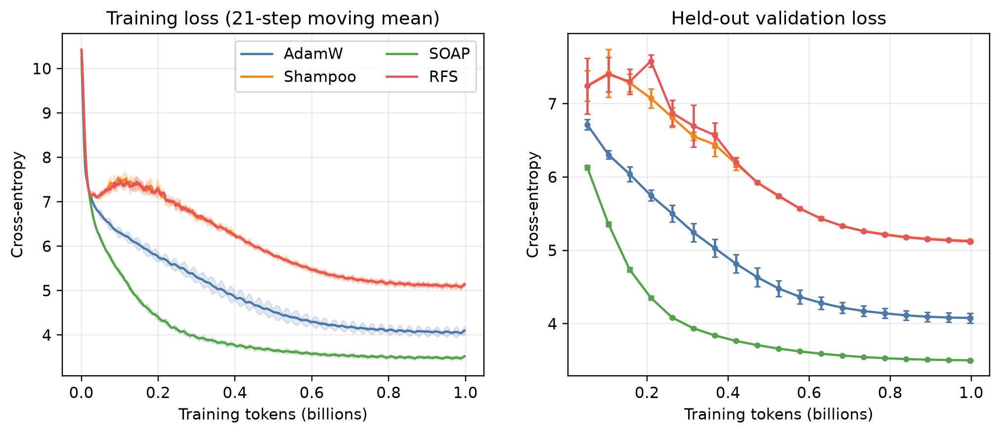
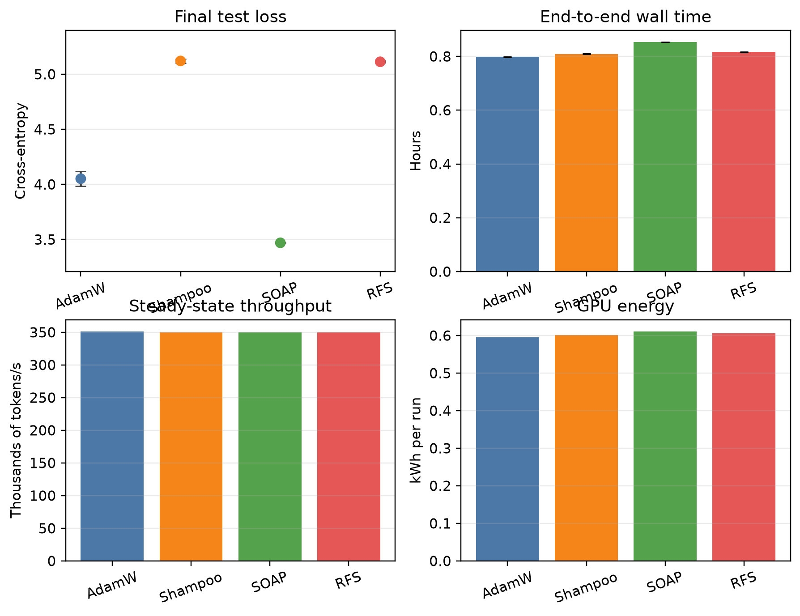

# Root-Free Shampoo on AMD MI300X

This repository is the reproducible empirical study of Root-Free Shampoo (RFS) on one AMD Instinct MI300X. I compare AdamW, dense Shampoo, SOAP, and RFS while training the same 124,439,808-parameter decoder-only Transformer on an exact one-billion-token FineWeb-Edu corpus.

The final result is deliberately mixed. SOAP is the strongest optimizer in this experiment, AdamW is second, and the tested Shampoo/RFS configuration does not beat either baseline. RFS does provide a numerically certified matmul-only inverse-fourth-root implementation, but its root kernel is not faster than the MI300X eigensolver at the tested 768×768 size. That negative result is part of the artifact.

## Final result

Each value is the mean ± sample standard deviation over seeds 1, 2, and 3 after 997,720,064 effective training tokens (the fixed batch geometry leaves the nominal 998M training split with a remainder).

| Optimizer | Test cross-entropy | Test perplexity `exp(mean loss)` | Wall hours | Median tokens/s | Peak VRAM |
| --- | ---: | ---: | ---: | ---: | ---: |
| AdamW | 4.0515 ± 0.0671 | 57.48 | 0.798 | 351.5k | 38.7 GiB |
| Shampoo | 5.1200 ± 0.0191 | 167.33 | 0.809 | 350.0k | 39.1 GiB |
| SOAP | **3.4697 ± 0.0034** | **32.13** | 0.853 | 349.6k | 39.0 GiB |
| RFS | 5.1123 ± 0.0081 | 166.05 | 0.816 | 350.1k | 39.1 GiB |

SOAP's quality lead is large and consistent across seeds. RFS and Shampoo are nearly tied with one another, but both underperform AdamW here. End-to-end throughput is similar because Transformer GEMMs dominate; SOAP takes about 7% more wall time than AdamW because of its periodic QR work.





### Reading the figures

The learning-curves figure has two panels. The left panel shows the 21-step moving mean of training cross-entropy; the translucent bands are the sample standard deviation over the three seeds. The right panel shows validation cross-entropy at the evaluation checkpoints with one-standard-deviation error bars. SOAP separates early and continues to improve throughout the run, AdamW follows it, and Shampoo/RFS remain close to one another near the top of the plot.

The systems figure summarizes the same runs from four angles: final test loss, end-to-end wall time, steady-state token throughput, and measured GPU energy. It makes the main systems tradeoff visible: SOAP has the best loss but the longest wall time, while all four methods have nearly the same throughput and memory footprint. The machine-readable values behind these panels are in [`figures/results.csv`](figures/results.csv), and the LaTeX table used by the paper is [`figures/results_table.tex`](figures/results_table.tex).

The native AdamW update kernel is 4.53× faster than the equivalent PyTorch elementwise composition on a 124,439,808-element flat state. The RFS root certificate reached a maximum residual of `6.81e-13` and a maximum relative difference of `1.15e-10` against the fp64 eigendecomposition reference. The tested RFS root itself took 175.5 ms versus 85.4 ms for eigendecomposition, so this repository makes no unsupported root-speed claim.

## Repository layout

- `rfs/model.py`: 12-layer GPT-2-style decoder and parameter-count checks.
- `rfs/optimizers.py`: AdamW, Shampoo, SOAP, and RFS implementations.
- `rfs/roots.py`: fp64 eigendecomposition reference and certified coupled Newton–Schulz RFS root.
- `rfs/kernels/`: HIP/C++ extension for gfx942 EMA, AdamW, affine, symmetrization, and parameter-update primitives.
- `rfs/prepare_fineweb.py`: pinned FineWeb-Edu download, GPT-2 tokenization, deterministic document split, and exact quota writer.
- `rfs/train.py`: BF16 training, fp32 logits loss, telemetry, checkpoints, runtime accounting, and resume-safe metrics.
- `rfs/sweep.py` and `rfs/refine_matrix.py`: constrained hyperparameter search.
- `rfs/final_runs.py`: rotated three-seed final matrix with a continuous runtime gate.
- `rfs/analyze.py`: aggregate CSV/JSON/LaTeX tables and paper figures.
- `configs/`: base, sweep, and matched Shampoo/RFS refinement configurations.
- `artifacts/sweeps/`: complete sweep logs and selected settings.
- `artifacts/final/`: all 12 final run summaries, JSONL metrics, telemetry, and runtime ledger.
- `figures/`: generated PNG/PDF figures and `results_table.tex`.
- `paper/main.tex`: the preprint source.

## Hardware and software

The recorded audit is in [`artifacts/system_audit.json`](artifacts/system_audit.json). The runs used one AMD Instinct MI300X VF (`gfx942`, 304 compute units, 192 GiB HBM), ROCm 7.14, HIP 7.14.60850, and PyTorch 2.12.0. The container is based on a digest-pinned ROCm PyTorch image and pins the Python support packages in `Dockerfile` and `pyproject.toml`.

## Reproduce

The commands below assume Docker, `/dev/kfd`, `/dev/dri`, and an MI300X-compatible ROCm installation.

```bash
gh repo clone tasmaikeni13/RFS
cd RFS
./scripts/container.sh python3 -m rfs.prepare_fineweb --output data/fineweb_edu_1b_gpt2
./scripts/container.sh python3 -m rfs.verify_data
./scripts/container.sh python3 -m rfs.audit_system
./scripts/container.sh python3 -m pytest -q
./scripts/container.sh python3 -m rfs.benchmark_kernels
```

To repeat the search and final matrix:

```bash
./scripts/container.sh python3 -m rfs.sweep
./scripts/container.sh python3 -m rfs.refine_matrix
./scripts/container.sh python3 -m rfs.final_runs \
  --best artifacts/sweeps/matrix_refinement/best.json
./scripts/container.sh python3 -m rfs.analyze
```

The data writer records the FineWeb-Edu repository revision, tokenizer, quotas, document counts, and SHA-256 hashes in `data/fineweb_edu_1b_gpt2/metadata.json`. The binary data is intentionally ignored by Git because it is large and reproducible. The final matrix uses 64 sequences per microbatch, eight-way gradient accumulation, context length 1024, BF16 parameters/activations, and fp32 cross-entropy logits.

## Provenance

Every run records wall time, peak VRAM, optimizer latency, power, temperature, GPU utilization, and token throughput. The resulting JSONL logs and runtime ledger are included so the systems measurements can be audited independently of the summary table.

## Caveats

This is one model, one corpus, one context length, one accelerator, and three seeds. The sweep is deliberately constrained rather than exhaustive. Dense preconditioners are used only where the configured axis dimensions permit them, with diagonal Adam behavior for larger axes. The results establish what happened in this controlled MI300X experiment; they do not establish universal optimizer rankings.

The complete preprint is [`paper/main.tex`](paper/main.tex), with references in [`paper/references.bib`](paper/references.bib).

## License

Released under Apache 2.0
